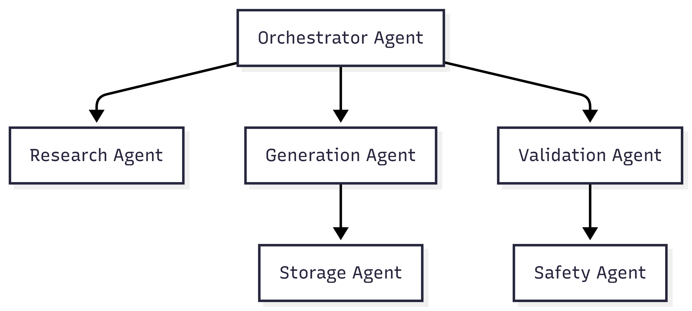
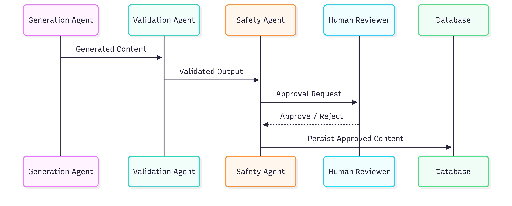

# Project Chimera – Architecture Strategy
**Agentic System Design for Spec-Driven, Governed Content Generation**


## 1. Architectural Overview

Project Chimera is designed as a **spec-driven, agentic system** capable of producing, validating, and governing high-velocity content (e.g., video metadata, generated assets, and analytical outputs). The architecture prioritizes:

- Clear separation of responsibilities between agents
- Strong governance and auditability
- Human-in-the-Loop safety enforcement
- Extensibility through agent social networks (OpenClaw model)

The system is intentionally structured so that **future agent swarms can extend it with minimal ambiguity**, guided by explicit specifications, protocols, and rules.


## 2. Agent Pattern Selection

### Chosen Pattern: Hierarchical Swarm

A **Hierarchical Swarm** pattern best fits Project Chimera due to the complexity of coordination, governance requirements, and the need for specialization.

**Rationale:**
- Enables role specialization (Planner, Executor, Validator, Auditor)
- Supports scalable task delegation
- Allows centralized rule enforcement without limiting autonomy
- Aligns naturally with agent social network models such as OpenClaw

### Agent Roles

| Agent | Responsibility |
|------|----------------|
| Orchestrator Agent | Task decomposition and agent coordination |
| Research Agent | Market, domain, and protocol analysis |
| Generation Agent | Content and metadata generation |
| Validation Agent | Policy checks and schema validation |
| Safety Agent | Human approval gating and compliance |
| Storage Agent | Metadata persistence and indexing |

### Agent Hierarchy Diagram




## 3. Human-in-the-Loop (Safety Layer)

### Approval Point

The **human approval step occurs after automated validation but before persistence or external publication**. This ensures:

- Unsafe or non-compliant outputs are blocked
- Accountability is preserved
- Regulatory and business constraints are respected

### Safety Workflow



**Principle:** No externally visible artifact is released without explicit human approval.


## 4. Agent Social Network Alignment (OpenClaw)

Project Chimera agents operate within an **Agent Social Network**, where agents communicate as peers with defined responsibilities rather than isolated tools.

### Network Characteristics
- Capability advertisement
- Task negotiation instead of hard-coded assignment
- Trust established via validation history and confidence signaling

This approach allows agents to collaborate dynamically while maintaining system-level governance.


## 5. Agent Communication & Social Protocols

To enable agent-to-agent collaboration (beyond human interaction), the following **social protocols** are required:

| Protocol | Purpose |
|--------|---------|
| Capability Discovery | Agents declare supported skills |
| Task Negotiation | Assign and accept responsibilities |
| Trust Signaling | Confidence scoring and validation history |
| Result Verification | Cross-agent confirmation of outputs |
| Failure Escalation | Graceful fallback and re-routing |

### Conceptual Message Structure

```json
{
  "agent_id": "validation_agent_01",
  "capability": "policy_check",
  "confidence": 0.96,
  "output_hash": "abc123",
  "dependencies_verified": true
}
```


## 6. Database Strategy

### Foundational Choice: SQL

For storing high-velocity video metadata, **SQL is the best foundational choice**. It provides:

- Strong schema consistency
- Transactional integrity
- Traceability and auditability
- Governance-friendly data modeling

This aligns with the explainability and compliance requirements of agentic systems.

### Supporting Layer: NoSQL (Optional)

NoSQL systems may be introduced later as a complementary layer for:
- High-speed caching
- Unstructured or semi-structured metadata
- Real-time ingestion pipelines

### Data Architecture


## 7. Spec-Driven Repository Alignment

This architecture is designed to integrate cleanly with a **GitHub Spec Kit–style repository**.

### Core Specifications
- `meta.md` – Vision, scope, and constraints
- `functional.md` – Agent and user behaviors
- `technical.md` – Architecture, protocols, data models
- `integration.md` – MCPs, APIs, CI/CD
- `rules.md` – IDE AI agent governance rules

This ensures low ambiguity and safe extensibility by future agent swarms.


## 8. Development Infrastructure

- Tenx MCP Sense for observability and engagement tracking
- Dockerized environments for reproducibility
- Test-Driven Development (failing tests first)
- CI/CD pipelines with policy, security, and governance checks


## 9. Summary

Project Chimera’s architecture balances agent autonomy with human oversight while maintaining strong governance and scalability. By combining a **Hierarchical Swarm**, **Human-in-the-Loop safety**, **SQL-first data strategy**, and **explicit agent social protocols**, the system provides a robust foundation for both implementation and future autonomous extension.

