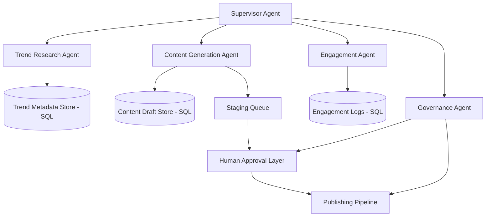

# Architecture Strategy – Project Chimera

## Overview
Project Chimera is an autonomous influencer system designed to research trends, generate content, and manage engagement with minimal human intervention. The goal is to build a robust, spec-driven architecture where multiple AI agents can operate safely under strong governance.

This document outlines the core architectural decisions for Chimera, focusing on agent orchestration, safety approval layers, and data storage strategy.

---

## 1. Agent Pattern Selection

### Recommended Pattern: Hierarchical Swarm Architecture

Chimera is best suited for a **Hierarchical Swarm** approach rather than a simple sequential chain.

In this design:

- A **Supervisor Agent** coordinates the workflow.
- Multiple specialized sub-agents execute focused responsibilities.

This pattern reduces complexity, improves scalability, and prevents one monolithic agent from becoming unstable.

### Key Sub-Agents

- **Trend Research Agent**: Collects trending topics and platform signals.
- **Content Generation Agent**: Produces captions, scripts, and media drafts.
- **Engagement Agent**: Handles replies, comments, and interaction loops.
- **Governance Agent**: Enforces safety policies and spec alignment.

### Why Hierarchical Swarm Fits Best

- Modular specialization improves reliability.
- Parallel execution enables faster content cycles.
- Easier to govern and test agent boundaries.

---

## 2. Human-in-the-Loop Safety Layer

Even though Chimera is autonomous, content publishing must include a **human approval checkpoint**.

### Approval Boundary

The human should approve content at the final stage before publishing.

Workflow:

1. Agent generates content draft
2. Draft stored in staging queue
3. Human reviews and approves
4. Only approved content is published

This ensures:

- Brand safety
- Compliance
- Prevention of harmful or hallucinated outputs

---

## 3. Database Strategy

Chimera will store high-velocity metadata including:

- trend snapshots
- video drafts
- engagement metrics
- publishing history

### Recommended Choice: SQL (PostgreSQL)

SQL is the best foundation because:

- Strong schema enforcement (important for agents)
- Supports relational queries across content, trends, and engagement
- Enables traceability and auditability

### Future Extension

NoSQL systems may be introduced later for caching unstructured artifacts, but SQL should remain the primary source of truth.

---

## 4. High-Level System Architecture

---

## 5. Summary

Project Chimera’s architecture is built around:

- **Hierarchical Swarm orchestration** for scalable agent collaboration
- **Human-in-the-loop governance** at the publishing boundary
- **SQL-based storage** for structured, high-integrity metadata

This foundation ensures Chimera is production-oriented, spec-aligned, and ready for autonomous agent development.

